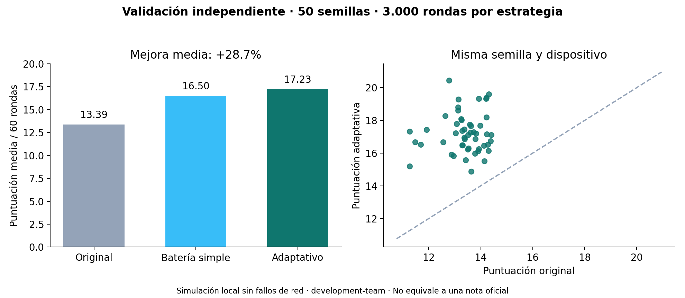

# Battery-aware Swarm Agent

A measured submission for the CoGNETs / VelesHack 2026 fourth challenge.

**Team:** Los Bocatones. `TEAM_NAME=los-bocatones`

**Members:** Marc and Carlos.

**Dockerfile:** `agent-template/Dockerfile`. Build: `docker build -t swarm-agent:submission agent-template`

**Status:** published public fork. GitHub Actions passed on 2026-10-07 with `TEAM_NAME=los-bocatones`: unit tests, native conformance, a Docker build from a clean checkout, and conformance against the built image. [Validation run](https://github.com/carlosclariana/veleshack-2026-4th-challenge/actions/runs/37601143158). Taikai submission is still pending.



## Start here

- [Explicación y demostración](delivery/EXPLICACION_Y_DEMO.md)
- [Hackathon form draft](delivery/FORMULARIO_HACKATON.md)
- [Delivery guide](delivery/LEEME_ENTREGA.md)
- [Guía paso a paso en español](GUIA_EQUIPO.md)
- [Measured results and limitations](RESULTS.md)
- [Technical strategy](STRATEGY.md)
- [Presentation](delivery/LosBocatones_VelesHack.pptx) and [pitch notes in Spanish](delivery/PRESENTACION_3_DIAPOSITIVAS.md)
- [Original challenge instructions](README.upstream.md)

## Build and run

```sh
docker build -t swarm-agent:submission agent-template
```

Set `TEAM_NAME` in a local `.env` copied from `.env.example`, then start all services:

```sh
docker compose --profile agent up --build
```

Leaderboard: http://localhost:8080. Agent settings: `ARENA_URL`, `TEAM_NAME`,
`LOG_LEVEL`, optional `STRATEGY_MODE` (default `adaptive`). No credentials needed.
For native installation and full validation:

```sh
python -m pip install -e .
python -m unittest discover -s tests -p 'test_*.py' -v
python tests/conformance.py
python experiments/benchmark.py --start 9000 --count 50
python experiments/live_match.py --team los-bocatones
```

For the archived holdout filename, use `--output results/holdout.json` in the benchmark command.
To regenerate the figure, install `matplotlib` and run `python experiments/report.py`.
To check the exact deliverable, build the image and run the suite against it:

```sh
docker build -t swarm-agent:submission agent-template
python tests/conformance.py --image swarm-agent:submission --team los-bocatones
```

GitHub Actions repeats both checks on a clean runner using `TEAM_NAME=los-bocatones`.

## Strategy write-up

Our agent treats battery charge as an economic resource. Winning energy creates immediate utility, but also consumes charge and can force an entire round of recharging. We therefore choose bids by estimating utility per active and recharge round, rather than maximising the current auction alone.

The policy reconstructs competing bids from our own settled allocations using the inverse Kelly mechanism. This avoids a timing inconsistency in the example estimator: result records contain previous clearing prices alongside current capacities. We normalise observations by historical spending, retain several recent markets, and include a conservative prior so returning opponents do not immediately invalidate our assumptions.

For each candidate energy bid, we examine compute and security splits, including explicit service floor boundaries. Every candidate receives the actual half or quarter penalty in markets where minimum allocations are missed. Estimated battery consumption reduces its value; consumption beyond available charge receives an additional waste penalty. All bids are finite, nonnegative and within budget. The implementation uses only Python standard library modules and public observations.

We compared the original policy, a simple battery taper, and our adaptive policy on fifteen development seeds. More aggressive energy conservation reduced idle rounds but also reduced score, so we rejected it. After freezing the policy, fifty separate validation seeds produced mean scores of 13.39 for the original and 17.23 for the adaptive agent, a 28.7 percent improvement. Our agent exceeded all three baselines in every validation run. These are local simulations, not official grading results.

We also measured the externality: neighbours earned less, and reported social welfare deteriorated. Individual improvement did not imply collective improvement. Network reliability is tested separately through the official conformance suite and a live graded match. The hidden reference agent remains unavailable, so we do not claim full strategy marks or guaranteed victory.

All experiments are reproducible.

## Attribution

Based on the CoGNETs Consortium challenge, upstream commit
`4a156a78e9b03ded7ac1273955c0cb314224ec70`. Apache-2.0; see LICENSE and NOTICE.
The arena scoring rules, baseline policies and official conformance suite are unchanged.
The local dashboard HTML has been redesigned for explanation and demo; it does not change scoring.

## Dashboard and presentation

The local panel puts the battery first: the whole screen is the cell stack, and
the selected team's remaining charge is the largest figure on it. Alongside it
are the live ranking, the open round's capacity and price per resource, fault
counts and network welfare. It includes Spanish explanations, a presentation
mode, JSON export and a clearly marked archived-run view. It reads public API
results only. It does not control bidding or change the evaluation server.

`delivery/PANEL_PREVIEW.html` is the same page opened on the archived run, for
showing it without Docker. Regenerate it with `python scripts/build_preview.py`
after any change to `arena/static/index.html`.

The presentation is `delivery/LosBocatones_VelesHack.pptx` (PDF alongside). It
follows the organisers' template slide for slide (title, GitHub repo, Summary,
Highlights) in the panel's own visual design. Speaker notes in Spanish are in the
file and in `delivery/PRESENTACION_3_DIAPOSITIVAS.md`. Rebuild it with
`node scripts/build_presentation.js delivery/LosBocatones_VelesHack.pptx`.

The archived benchmark figures were measured with the test team `development-team`.
Runs with the real team name are in `results/team-*.json`.
